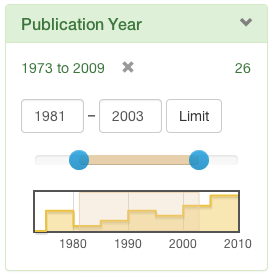

BlacklightDateRangeLimit:  date range limit for Blacklight applications



# Description

The BlacklightDateRangeLimit plugin provides a limit for date fields, that lets the user enter range limits with a text box or a date-picker. This plugin was cloned from [blacklight_range_limit](https://github.com/projectblacklight/blacklight_range_limit) plugin.

# Requirements

A Solr date field. Depending on your data, it may or may not be advantageous to use a tdate (trie with non-zero precision) type field. 

# Installation

The 6.x version of `blacklight_date_range_limit` work with `blacklight` 6.x -- we now synchronize the _major version number_ between `blacklight` and `blacklight_date_range_limit`.

Add

    gem "blacklight_date_range_limit"

to your Gemfile. Run "bundle install". 

Then run 

    rails generate blacklight_date_range_limit:install

This will install some asset references in your application.js and application.css.

# Configuration

You have at least one solr field you want to display as a range limit, that's why you've installed this plugin. In your CatalogController, the facet configuration should look like:

```ruby
config.add_facet_field 'pub_date', label: 'Publication Year', date_range: true 
```
  
You should now get range limit display.

## Javascript dependencies

The selectable histograms/barcharts are done with Javascript, using [Flot](http://code.google.com/p/flot/). Flot requires JQuery, as well as support for the HTML5 canvas element. In IE previous to IE9, canvas element support can be added with [excanvas](http://excanvas.sourceforge.net/). For the slider, [bootstrap-slider](http://www.eyecon.ro/bootstrap-slider/) is used (bootstrap-slider is actually third party, not officially bootstrap). Flot and bootstrap-slider are both directly included in blacklight_range_limit in vendor. 

A `require 'blacklight_date_range_limit'` in a Rails asset pipeline manifest file will automatically include all of these things. The blacklight_date_range_limit adds just this line to your `app/assets/application.js`. 

There is a copy of flot vendored in this gem for this purpose. jquery is obtained from the jquery-rails gem, which this gem depends on. 

Note this means a copy of jquery, from the jquery-rails gem, will be included in your assets by blacklight_date_range_limit even if you didn't include it yourself explicitly in application.js. Flot will also be included.

If you don't want any of this gem's JS, you can simply remove the `require 'blacklight_date_range_limit'` line from your application.js, and hack something else together yourself. 
